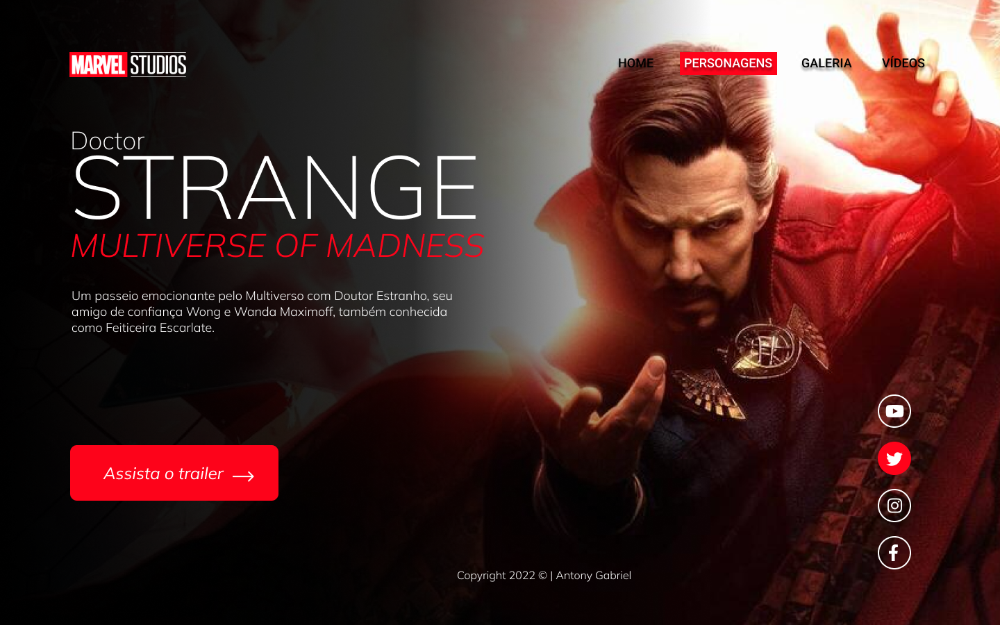
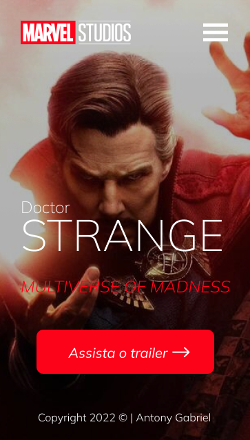

# Dr.estranho
Proeto construido durante as aulas de Lima, no curso de desenvolvimento de sistemas [SENAI JANDIRA](https://jandira.sp.senai.br/), com orientação do Prof. [Fernando Leonid](href="https://github.com/fernandoleonid)

---

## Qual era o objetivo do projeto?
O objetivo era criar uma landing page com base no design feito no figma,   :aprendendo a estrutura do HTML, CSS, JS e conceitos de responsividade.

---
## O que é Landing Page?
Landing Page são páginas com foco principal na conversão de visitantes, assim, essa páginas possuem uma estética mais minimalista comparada com sites tradicionais

---
## Tecnologias Usadas
- HTML 5
- CSS 3
- Javascript
- Figma

---
## Links
- [Resultado](https://antonygabriell.github.io/Dr.estranho/)
- [Projeto Figma](https://www.figma.com/file/qO1EpaLMTVwQ4B3jB4CdaO/Lima-design?node-id=0%3A1)
- [Código](https://github.com/AntonyGabriell/Dr.estranho)

---
## Autor